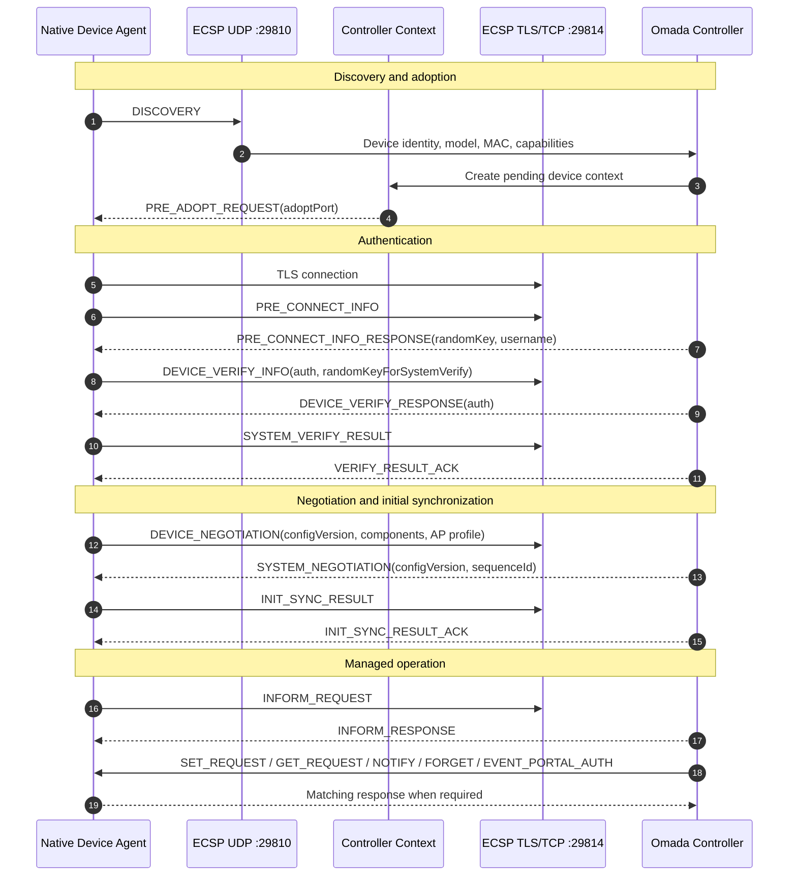

# OpenOmada Native Agent

> Native C++17 transcode of the Python Open Omada Device Agent for constrained
> embedded Linux/OpenWrt devices.

This directory contains the production-oriented native implementation of the
Open Omada Device Agent. The parent repository's Python implementation remains
the behavioral reference: protocol semantics must be copied from the Python
agent and its tests, not redesigned during the port.

The goal of this native port is to preserve the validated Omada ECSP wire
behavior while reducing runtime cost enough to run on old and low-end OpenWrt
hardware such as MIPS32/MIPSel, ARMv7, AArch64, 16 MB flash devices where
practical, and 32-64 MB RAM devices.

This is a transcode from Python to native C++17, not a line-by-line rewrite and
not a C API library. In project discussions this work may be called the "C"
agent, but the implementation language is conservative C++17 because RAII,
typed value objects, and testable interfaces are useful for safely handling
sockets, TLS, JSON, files, and OpenWrt process boundaries on musl systems.

> [!WARNING]
> This project is alpha software. It is unofficial, unaffiliated with TP-Link
> or Omada, and must not be used on production networks until the specific
> controller version, OpenWrt target, and device workflow have been validated.

## Migration Scope

The native implementation is being built in phases. Each phase preserves the
Python behavior first, then prepares lower-cost OpenWrt execution.

| Phase | Scope | Current Status |
| --- | --- | --- |
| Phase 1 | CMake skeleton, utility types, MAC policy, ECSP constants, ECSP frame codec, JSON boundary, auth/hash primitives, characterization tests | Implemented and unit-tested |
| Phase 2 | Lifecycle state machine, UDP discovery transport, TCP/TLS management transport, ECSP V2 authentication, negotiation, initial sync | Implemented and tested with scripted controller frames |
| Phase 3 | Non-secret managed-state persistence, managed reconnect policy, managed rediscovery fallback, periodic INFORM scheduler | Implemented and unit-tested |
| Phase 4 | Typed AP configuration model, `SET_REQUEST` parsing, configVersion/configVersionInc semantics, `SET_RESPONSE`, `GET_RESPONSE`, defensive NOTIFY, FORGET | Implemented and unit-tested |
| Phase 5 | OpenWrt capability detection, UCI radio/WLAN/SSID VLAN/management VLAN planning, hostapd/ubus telemetry parsing, DHCP enrichment, stale-client filtering | Implemented with fixture/process-backed adapters; live OpenWrt validation still required |
| Phase 6 | openNDS captive portal policy mapping, ThemeSpec redirect, walled garden/free-policy rules, client auth/deauth, conntrack cleanup, portal client state telemetry | Implemented with openNDS command executor; live portal validation still required for each controller/app flow |
| Phase 7 | OpenWrt package scaffold, `procd` init script, `/etc/config/openomada`, SDK staging helper, size/resource docs | Implemented; cross-compilation must be run on target SDKs |
| Daemon live | Runtime config loader, process-backed OpenWrt executor, live INFORM provider, long-running daemon composition for reconnect/discovery/adoption/managed loop | Implemented with smoke tests; live Omada/OpenWrt parity test still pending |

The branch currently has a real daemon entry point. It is still not a complete
replacement for the Python agent until live adoption, real SET application,
client telemetry, captive portal, reconnect, and restart behavior are validated
against the target Omada Controller and OpenWrt image.

## Current Status

The current native implementation targets the ECSP V2 family observed by the
Python reference around Omada Network Application `6.2.14.11` and an
EAP110-v4-compatible AP profile.

| Area | Status |
| --- | --- |
| UDP discovery / site-scoped discovery | Working in native code; fixture-tested |
| `PRE_ADOPT_REQUEST` handling | Working in native code; fixture-tested |
| TLS management channel | Wired with OpenSSL TLS 1.2 transport; live controller test pending |
| ECSP V2 Device Account verification | Working in native code; scripted tests |
| Device/system negotiation | Working in native code; scripted tests |
| Initial sync | Working in native code; scripted tests |
| Managed state persistence | Working; owner-only JSON file, no password persistence |
| Restart without another manual Adopt | Implemented through managed reconnect; live validation pending |
| Managed rediscovery / stale-context recovery | Implemented; live validation pending |
| Periodic device informs | Implemented; live OpenWrt provider when `ubus` is available |
| `SET_REQUEST` acknowledgement | Partial; unsupported or unapplied families return explicit error |
| Radio/SSID configuration | Partial OpenWrt UCI reconciliation |
| SSID VLAN configuration | Partial opt-in OpenWrt UCI reconciliation |
| Management VLAN configuration | Partial opt-in OpenWrt UCI reconciliation |
| DHCP, openNDS and hostapd client reporting | Partial; hostapd association is the active source of truth |
| OpenWrt radio/SSID telemetry | Partial via `ubus`, hostapd counters, SSID stats and radio traffic aggregates |
| Client operations and rate limits | Parsed but rejected in native daemon until a backend is implemented |
| LED enable/disable/locate | Parsed but rejected in native daemon until a backend is implemented |
| FORGET / forget-no-reset response | Working |
| Captive portal sessions/enforcement | Partial through openNDS policy, ThemeSpec, auth/deauth and portal state reporting |
| Portal RADIUS authentication | Not implemented in native daemon |
| `GET_REQUEST` | Defensive unsupported-key responses |
| Notify families | Defensive replies/no-reply handling |
| REPORT family | Not implemented; do not advertise support |
| Firmware upgrade | Not implemented; do not advertise support |
| Switch/gateway/OLT profiles | Not implemented |

The capability policy is intentionally conservative. The native agent must not
advertise or ACK a capability simply because a field name is known. When a
controller sends a parsed but unsupported actionable family, the daemon returns
an explicit error response and keeps local config metadata unchanged.

## Protocol At A Glance

ECSP is modeled as device-to-controller discovery followed by a length-prefixed
JSON management session over TLS/TCP. TCP messages use a 4-byte big-endian
length prefix followed by UTF-8 JSON.



The native code keeps this flow split by responsibility:

```text
Controller
  -> ECSP transport/framing
  -> protocol JSON boundary
  -> lifecycle state machine
  -> typed application/domain model
  -> platform ports
  -> OpenWrt adapters
```

Telemetry flows in the reverse direction:

```text
OpenWrt observations
  -> typed wireless/client/portal state
  -> INFORM projection
  -> ECSP JSON serialization
  -> ECSP frame transport
  -> Controller
```

## Native Architecture

```text
include/openomada/
  application/   use cases, daemon config, platform ports, configuration model
  crypto/        ECSP V2 authentication primitives
  domain/        MAC address and access point profile value objects
  lifecycle/     discovery, adoption, reconnect, managed session handling
  openwrt/       OpenWrt UCI, telemetry, process and openNDS adapters
  persistence/   non-secret managed-state repository
  platform/      capability detection and feature policy
  protocol/      ECSP constants, frame codec, JSON helpers and builders
  transport/     UDP discovery and TLS/TCP frame transport

src/
  cli/           daemon entry point and runtime composition
  ...            implementation matching the public include tree

openwrt/
  Makefile       OpenWrt package scaffold
  files/         procd init and default UCI config

tests/
  *.cpp          unit, fixture and smoke tests
  fixtures/      daemon config fixtures
```

Important design rules:

- ECSP protocol code must never call OpenWrt commands directly.
- Raw JSON is allowed at the ECSP boundary only.
- Platform adapters receive typed configuration and client state.
- MAC addresses are stored internally as `aa:bb:cc:dd:ee:ff`.
- MAC addresses sent toward Omada use `AA-BB-CC-DD-EE-FF`.
- Device Account passwords are never logged or persisted.
- Captive portal enforcement is delegated to openNDS, not reimplemented.
- The process executor uses argv-based execution, not shell interpolation.

## Build And Test

Native development build:

```sh
cmake -S . -B build -DCMAKE_BUILD_TYPE=RelWithDebInfo
cmake --build build
ctest --test-dir build --output-on-failure
```

Size-oriented build:

```sh
cmake -S . -B build-small \
  -DCMAKE_BUILD_TYPE=MinSizeRel \
  -DOPENOMADA_BUILD_TESTS=OFF \
  -DCMAKE_CXX_FLAGS="-fno-exceptions -fno-rtti"
cmake --build build-small
strip build-small/openomada-agent-native
size build-small/openomada-agent-native
```

Local benchmark helper:

```sh
./scripts/benchmark_resource_usage.sh /tmp/openomada-native-size
```

Current local daemon-live measurement on macOS arm64:

| Profile | Value |
| --- | ---: |
| Stripped binary | 306,816 bytes |
| Local discovery-loop RSS sample | 7,440 KB |

These numbers are not OpenWrt release measurements. Real package size and RSS
must be measured on each target SDK/rootfs after live controller adoption works.

## Runtime Configuration

The deployed runtime uses an OpenWrt-style UCI config file. The default path is:

```text
/etc/config/openomada
```

For development and tests, override it with either:

```sh
openomada-agent-native --config ./tests/fixtures/openomada-enabled.config
```

or:

```sh
OPENOMADA_CONFIG=./tests/fixtures/openomada-enabled.config openomada-agent-native
```

Minimal config shape:

```text
config controller 'main'
	option enabled '1'
	option host '192.168.1.10'
	option controller_id ''
	option site_id ''
	option username ''
	option password 'device-account-password'

config agent 'main'
	option log_level 'info'
	option protocol_trace '0'
	option platform 'openwrt'
	option radio_bands '2g'
	option max_ssids '4'
	option state_path '/var/lib/openomada/managed-state.json'
	option inform_interval_ms '30000'
	option tcp_timeout_seconds '15'
	option reconnect_delay_ms '3000'
	option managed_reconnect_attempts '3'
	option discovery_port '29810'
	option manage_port '29814'
	option local_discovery_port '0'

config device 'main'
	option name 'OpenOmada-AP'
	option mac '02-11-22-33-44-55'
	option model 'EAP110'
	option model_version '4.0'
	option hardware_version '4.0'
	option firmware_version '5.0.4'

config portal 'main'
	option enabled '1'
	option engine 'opennds'
	option gatewayfqdn 'disable'
	option themespec_path '/usr/lib/opennds/theme_openomada_redirect.sh'
	option flush_conntrack_on_deauth '1'
```

The packaged default config is intentionally disabled:

```text
option enabled '0'
```

Enable it only after setting at least controller host, Device Account password,
and device MAC.

Useful commands:

```sh
openomada-agent-native --version
openomada-agent-native --help
openomada-agent-native --check-config --config /etc/config/openomada
openomada-agent-native --dry-run --config /etc/config/openomada
openomada-agent-native --once --config /etc/config/openomada
```

`--dry-run` loads config and detects local platform capabilities without opening
discovery or management sockets. `--once` exits after reconnect/adoption and
initial sync, which is useful for live controller smoke testing.

## Runtime Behavior

First run:

1. Load `/etc/config/openomada`.
2. Detect OpenWrt tools and capabilities.
3. Send ECSP `DISCOVERY` over UDP.
4. Wait for `PRE_ADOPT_REQUEST`.
5. Open TLS/TCP management connection.
6. Run ECSP V2 Device Account verification.
7. Negotiate and send `INIT_SYNC_RESULT`.
8. Persist non-secret managed state.
9. Enter managed loop and send periodic `INFORM_REQUEST`.

Restart with managed state:

1. Load persisted controller/site/config metadata.
2. Attempt direct managed reconnect with `PRE_CONNECT_INFO(rebuild=1)`.
3. If direct reconnect repeatedly fails, send managed rediscovery with
   `isFactory=false`.
4. Fall back to normal discovery/adoption when needed.

Managed loop:

- Sends `INFORM_REQUEST` using live OpenWrt telemetry when `ubus` is available.
- Handles `SET_REQUEST` through the composite platform applier.
- Handles defensive `GET_REQUEST` and NOTIFY replies.
- Handles `EVENT_PORTAL_AUTH` through openNDS when portal support is enabled.
- Handles FORGET by replying and clearing managed state.
- Reconnects after transport failures.
- Exits on SIGINT/SIGTERM.

## OpenWrt Package

Stage the package into an OpenWrt SDK:

```sh
./scripts/stage_openwrt_package.sh /path/to/openwrt-sdk/package/openomada
```

Build it from the SDK root:

```sh
make package/openomada/compile V=s
```

Runtime dependencies are intentionally ordinary OpenWrt packages:

- `libstdcpp`
- `libjson-c`
- `libopenssl`
- `opennds`
- `conntrack`

The init script:

- uses `procd`;
- reads `/etc/config/openomada`;
- honors `controller.enabled`;
- creates the managed-state directory;
- passes non-secret values as environment variables;
- passes `OPENOMADA_CONFIG` so the daemon reads the same config file;
- does not pass the Device Account password in argv or environment.

OpenWrt service flow:

```sh
/etc/init.d/openomada enable
/etc/init.d/openomada start
logread -f | grep openomada
```

## OpenWrt Backend

The current native OpenWrt backend is process-backed:

- `uci batch` for WLAN/radio/VLAN config commits;
- `wifi reload` after changed wireless config;
- `ubus call network.wireless status` for radio/interface observations;
- `ubus call hostapd.<ifname> get_clients` for associated client state;
- `ndsctl json`, `ndsctl auth`, and `ndsctl deauth` for openNDS state;
- `conntrack -D` for deauth flow cleanup when the client IP is known;
- atomic ThemeSpec writes through an internal `write-file` pseudo-command.

This is intentionally behind interfaces. Later optimization should replace
high-churn process calls with `libuci`, `libubus`, `libubox`, and `uloop` where
that reduces flash/RAM cost and improves latency on real OpenWrt targets.

## Captive Portal

The native agent does not implement its own captive portal. It translates Omada
portal intent into openNDS policy and ThemeSpec scripts.

Implemented behavior:

- Omada `portalFreePolicyConfig` maps to openNDS walled-garden FQDN and
  preauthenticated IP rules.
- Omada portal URL fields map to the external portal redirect target.
- The generated ThemeSpec appends TP-Link-style query parameters:
  `clientMac`, `clientIp`, `t`, `site`, `redirectUrl`, `apMac`, `ssidName`,
  and `radioId`.
- `gatewayfqdn=disable` is set in the openNDS plan so redirects use the gateway
  IP instead of depending on clients resolving `status.client`.
- `allow_preemptive_authentication=0` is set so clients follow the normal HTTP
  redirect path.
- `EVENT_PORTAL_AUTH` and `clientConfig.unauth` map to `ndsctl auth/deauth`.
- Conntrack cleanup is attempted after deauth when available.
- `ndsctl json` portal state is merged into client telemetry.

Current limitation:

- The external portal application is responsible for authenticating users and
  calling the Omada Controller authorization API. The native agent only handles
  AP-side openNDS policy and client auth/deauth commands.

## MAC Address Policy

MAC formatting is protocol-sensitive.

Internal representation:

```text
aa:bb:cc:dd:ee:ff
```

Controller-facing representation:

```text
AA-BB-CC-DD-EE-FF
```

This applies to:

- ECSP headers;
- `deviceInfo.mainMac`;
- AP MAC fields;
- client stats;
- BSSID/SSID-related fields where present;
- portal redirect `clientMac` and `apMac`;
- openNDS/portal authorization mapping.

## Security Model

The daemon treats all controller messages as untrusted input.

Current protections:

- bounded ECSP frame decoding;
- explicit network byte order for frame lengths;
- typed MAC parsing and normalization;
- VLAN range validation;
- no shell interpolation for runtime commands;
- no password logging;
- no password persistence;
- owner-only managed-state file mode;
- atomic managed-state writes;
- explicit error responses for unsupported actionable config.

Still required before production use:

- live fuzz/negative testing against malformed controller messages;
- target-specific TLS verification policy;
- OpenWrt package hardening review;
- replacement of frequent process calls with native APIs where beneficial;
- live captive portal security review with the external portal application.

## Unsupported Protocol Families

The native daemon intentionally does not fake support for:

- `REPORT`;
- firmware upgrade;
- file transfer;
- remote terminal;
- mesh;
- switch/gateway/OLT profiles;
- WPA Enterprise/RADIUS WLAN configuration;
- generic client operations;
- client rate limits;
- LED control.

Some of these fields may already be parsed so the daemon can reject them
cleanly. Parsing is not the same as support.

## Documentation

- [Building](BUILDING.md)
- [Migration plan](MIGRATION_PLAN.md)
- [Porting status](PORTING_STATUS.md)
- [Resource usage](RESOURCE_USAGE.md)
- [OpenWrt package notes](openwrt/README.md)

The Python reference repository also contains the broader protocol research
documentation:

- `docs/architecture.md`
- `docs/protocol-overview.md`
- `docs/ecsp-wire-format.md`
- `docs/device-lifecycle.md`
- `docs/protocol-status.md`
- `docs/configuration.md`
- `SECURITY.md`

## Research And Provenance

The implementation is based on clean-room interoperability work, lab testing,
packet captures, controller logs, decompiled-controller behavior analysis, and
the Python reference implementation.

This native repository must not include vendor firmware, vendor source code,
decompiled vendor code, certificates, private keys, proprietary assets, or
packet captures containing secrets.

## Contributing

Useful contributions include:

- Python-vs-native characterization fixtures;
- OpenWrt SDK build reports for MIPS, MIPSel, ARMv7, AArch64 and x86_64;
- controller-version compatibility reports;
- live adoption/reconnect/captive-portal traces with secrets removed;
- small native backend improvements behind existing interfaces;
- tests that preserve known Python wire behavior.

Do not submit behavior changes that silently alter ECSP semantics. When unsure,
preserve Python behavior and document the uncertainty.

## License

This native implementation follows the parent OpenOmada project license. See
the parent repository's license files for the current project-wide license and
notice terms.
